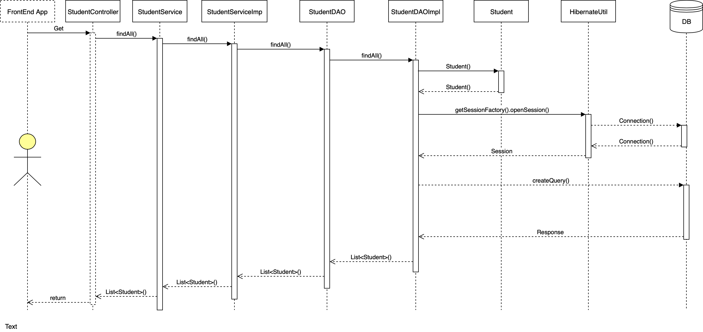
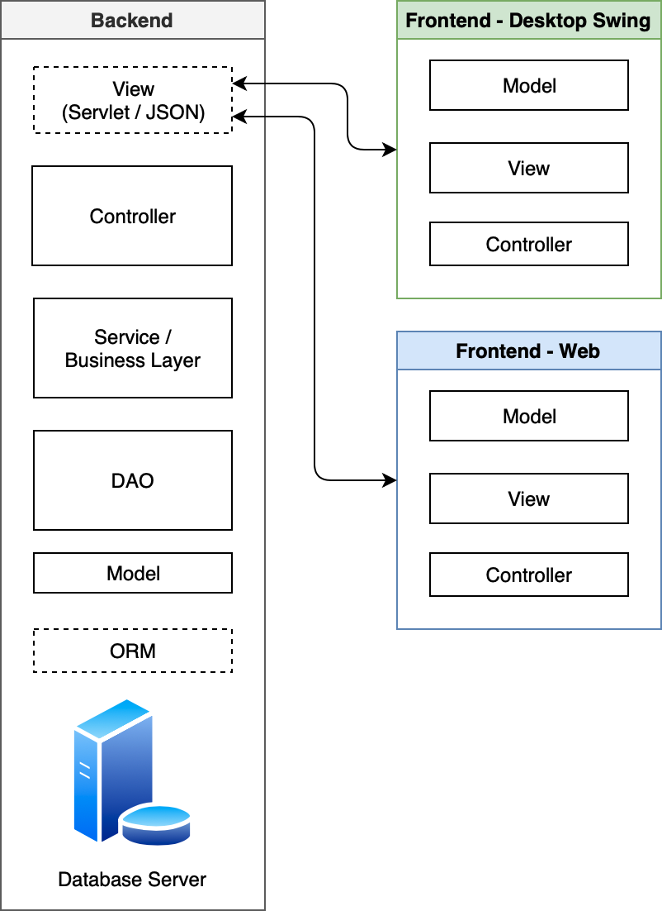
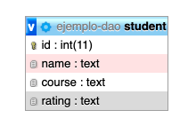
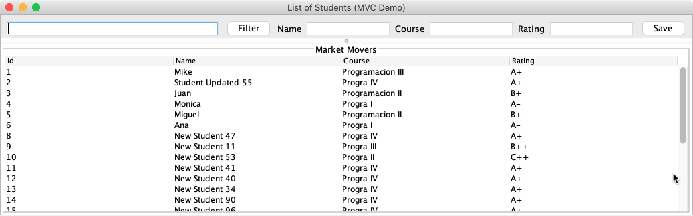
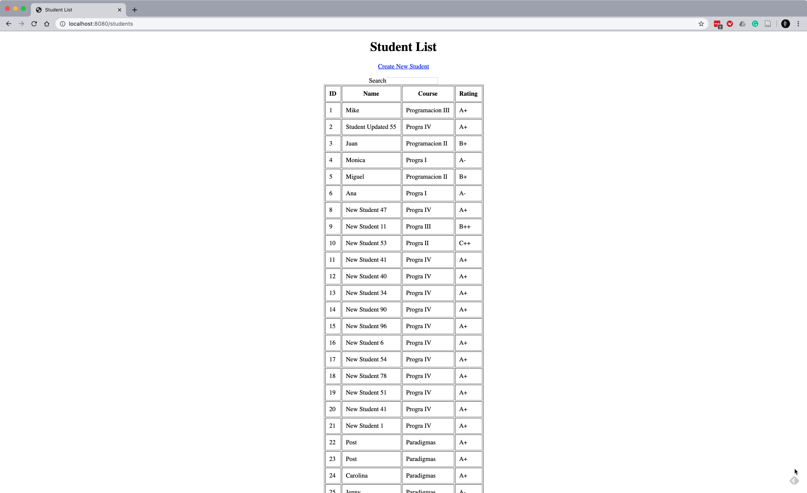

# Ejemplo completo de un BackEnd con SpringBoot
## Diagramas

### Diagrama de secuencia

### Diagrama de interconexión

### Diagrama de la base de datos (Entidad-Relación)

## Dependencias

- Java
- MySQL
- Hibernate
- Spring Boot
  - Spring Boot Actuator
  - Spring Boot Web

## Descripción

El ejemplo representa un *backend* desarrollado en capas el cual es accesado por medio de un webservice RESTFUL a través del siguiente endpoint:

> http://localhost:8083/api/students 

Los métodos desarrollados son:

- [GET] Obtener todos los estudiantes
- [GET] Obtener un estudiante
- [POST] Almacenar un estudiante

Los *frontend* que consumen estos servicios estan en los siguientes Git repos:

1. Frontend para desktop swing: https://github.com/una-eif206-progra3-master/ejemplo-full-frontend-swing

1. Frontend para web: https://github.com/una-eif206-progra3-master/ejemplo-full-frontend-web

